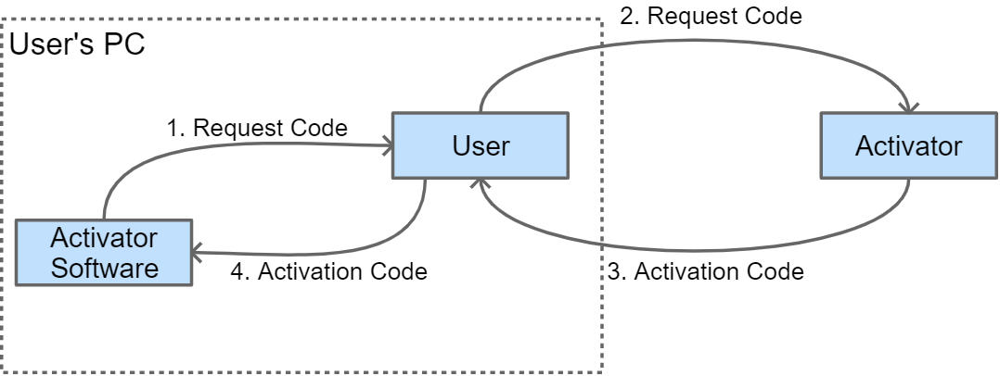

# CProtect

Copy protection and product activation utility written in Go.

## Introduction

Although software copy protection is an error-prone task to implement, this utility tries its best to accomplish that. Keywords:

* Activator - is a server or a person with license rights and activation capabilities.
* Request Code - is the computer's finger-print. A user attempting to install the product would get a request code. The user then would send this code to the activator.
* Activation Code - is the final code that will activate the application. The user will need to get this code from the activator server or person.
* Product - is the name of the software.
* Password - is a secure password held by the activator. Its length should be a multiple of 8, such as 16, 24, etc.
* Finger print service - enables generating a unique ID for a machine.
* Vault service - enables reading and writing activation codes securely. 



## API

To get the default finger-printing and vault services:

```go
fingerprint_service := cprotect.GetFingerprintService()
vault := cprotect.GetVaultService()
```

To get the request code:

```go
reqCode, _ := cprotect.GetRequestCode("My Product", fingerprint_service)
```

To check if the product is installed in this PC:

```go
isInstalled, _ := cprotect.IsInstalled(
    "My Product", 
    <password>,
    <for_all_users>,
    fingerprint_service,
    vault)
```

To check if an activation code is valid:

```go
valid, _ := cprotect.IsActivationCodeValid(<password>, <request-code>, <activation-code>)
```

To activate software using activation code:

```go
err := cprotect.Install("My Product", <activation-code>, <for_all_users>, vault)
```

## Building Activator

An activator is a stand-alone application that will be distributes along with the software product for end-users. An end-user will run the application to activate their app instance.

Build using `make build-activator` by supplying a product name and password:

```shell
make build-activator CPROTECT_PRODUCT=myapp CPROTECT_PASSWORD=activatepa55w0rd
```

Build a GUI activator using:

```shell
make build-activator-gui CPROTECT_PRODUCT=myapp CPROTECT_PASSWORD=activatepa55w0rd

# or from an environment variable:
make build-activator-gui CPROTECT_PRODUCT=myapp CPROTECT_PASSWORD=$(CPROTECT_PASSWORD)
```

## Building Activator Admin

An activator admin is an application that is supposed to remain only at the activators end. Build it using:

```shell
make build-admin
```